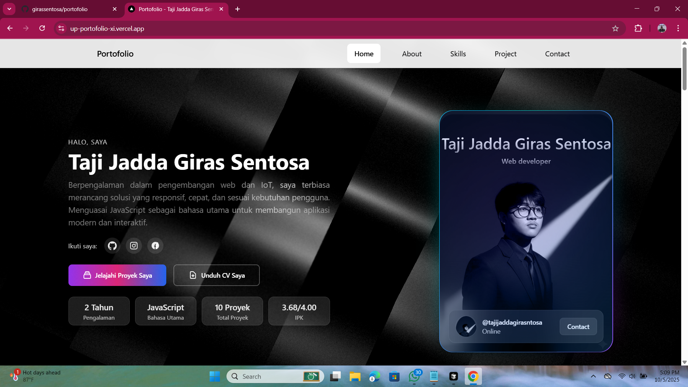
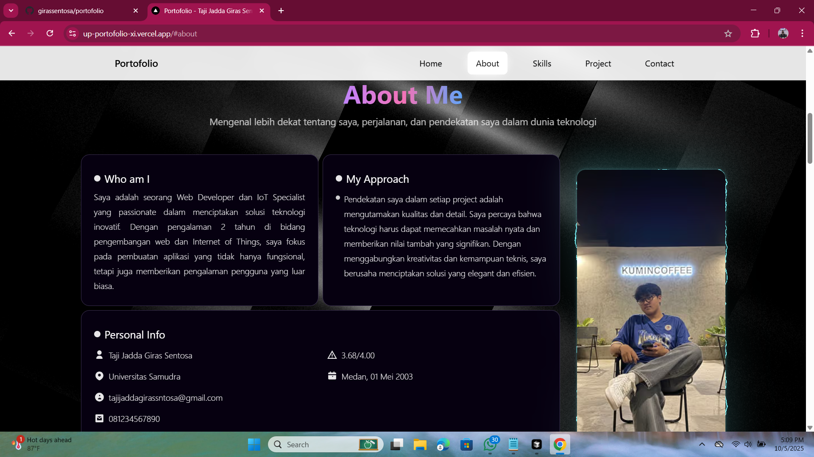
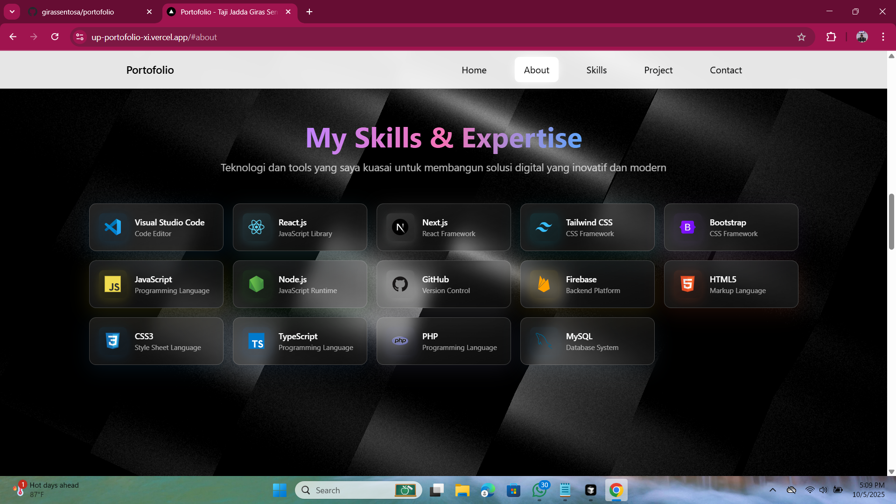
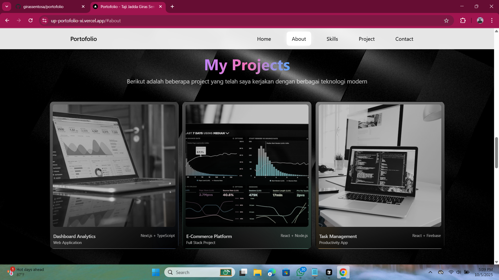
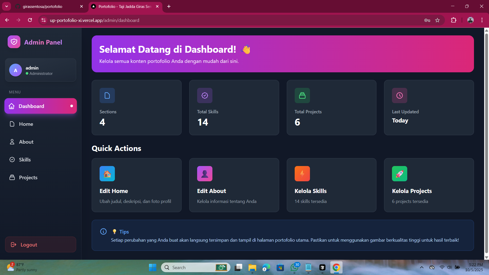
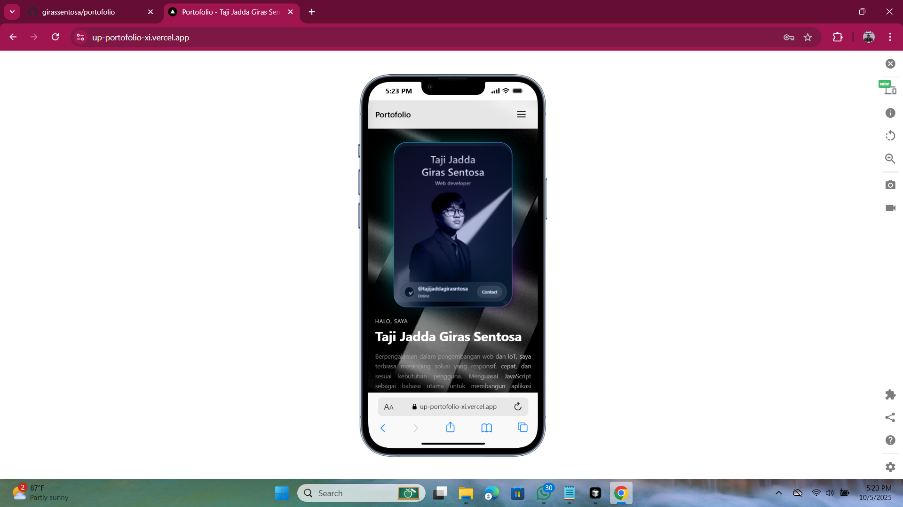

# 🎨 Portfolio Website

### ✨ Modern & Interactive Personal Portfolio ✨

[🌐 **Live Demo**](https://your-portfolio-url.vercel.app) • [📖 Documentation](#) • [🚀 Quick Start](#)

---

### 🎯 **Beautiful. Fast. Modern.**

Portfolio website yang dibangun dengan teknologi modern, dilengkapi dengan **3D animations**, **admin panel**, dan **fully responsive design**.

---

## 📸 Preview

### 🏠 **Homepage**

<i>Stunning 3D background animations powered by Three.js</i>

 

### 📱 **Main Sections**
| About Section | Skills Section | Projects Section |
|:---:|:---:|:---:|
|  |  |  |

 

### 🔐 **Admin Dashboard & Mobile View**
| Admin Dashboard | Mobile View |
|:---:|:---:|
|  |  |

---

## ✨ Features

<table>
<tr>
<td width="50%">

### 🎭 **Frontend Magic**
- ✅ **3D Background Animations** with Three.js & React Three Fiber
- ✅ **Smooth Scroll Animations** with Framer Motion & GSAP
- ✅ **Fully Responsive Design** for all devices
- ✅ **Modern Glassmorphism UI** with Tailwind CSS
- ✅ **Interactive Particle Effects** on hover
- ✅ **Optimized Performance** (Image optimization, lazy loading)
- ✅ **SEO Ready** with Next.js metadata

</td>
<td width="50%">

### 🔐 **Admin Panel**
- ✅ **Easy Content Management** via dashboard
- ✅ **Edit Home, About, Skills, Projects** sections
- ✅ **Add/Edit/Delete Projects & Skills** on the fly
- ✅ **Real-time Updates** reflected instantly
- ✅ **Secure Authentication** with session cookies
- ✅ **Protected Routes** for admin pages
- ✅ **Responsive Admin UI** for mobile management

</td>
</tr>
</table>

---

## 🛠️ Tech Stack

| Category | Technologies |
|----------|-------------|
| **Framework** |   |
| **Language** |  |
| **Styling** |   |
| **3D Graphics** |  React Three Fiber |
| **Animation** |  GSAP |
| **Database** |   |
| **Auth** |  js-md5 |
| **Deployment** |  |

---

### ⭐ Star this repo if you like it!

**Made with ❤️ and ☕ by Taji Jadda Giras Sentosa**

**Happy Coding! 🚀**

